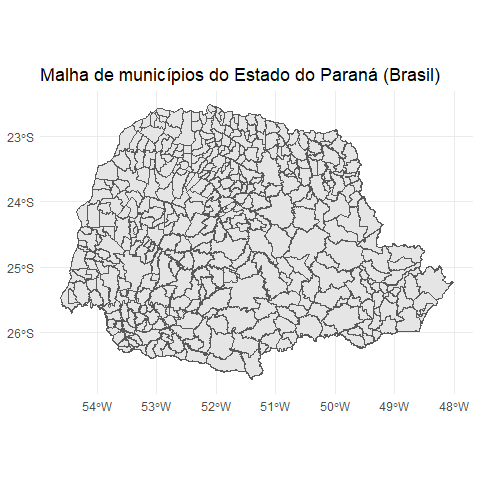

Malha de municípios no estado do Paraná - BR
================

-   [Baixando os dados](#baixando-os-dados)
-   [Lendo o arquivo:](#lendo-o-arquivo)

Baixando os dados
=================

Primeiro, criamos uma pasta onde os arquivos serão salvos:

``` r
rm(list=ls())
dir.create(  ".\\shp", showWarnings = FALSE)
```

Em seguida, montamos uma *url* para *download* dos arquivos do [IBGE](https://downloads.ibge.gov.br/downloads_geociencias.htm):

``` r
u_ibge <- paste0("ftp://geoftp.ibge.gov.br/organizacao_do_territorio/",
                 "malhas_territoriais/malhas_municipais/",
                 "municipio_2015/UFs/PR/pr_municipios.zip",
           collapse = "")
```

Pega a *url* do site e salva no diretório criado:

``` r
httr::GET(u_ibge,                              # lê a url
         # httr::write_disk(".\\shp\\pr.zip")  # salva em disco
          ) 

# dezipa os arquivo com unzip()
unzip(".\\shp\\pr.zip",
      exdir = ".\\shp\\pr")
```

Lendo o arquivo:
================

Para ler esses arquivos num objeto do `R`, utilizamos a função `sf::st_read()`:

``` r
library(tidyverse)
library(sf)
sf_municipio <- st_read("./shp/pr/41MUE250GC_SIR.shp", quiet = TRUE) %>% glimpse()
```

    ## Observations: 399
    ## Variables: 3
    ## $ NM_MUNICIP <fct> ALTAMIRA DO PARANÁ, ALTÔNIA, ALTO PARANÁ, ALTO PIQU...
    ## $ CD_GEOCMU  <fct> 4100459, 4100509, 4100608, 4100707, 4100905, 410100...
    ## $ geometry   <POLYGON [°]> POLYGON ((-52.70392 -24.747..., POLYGON ((...

``` r
library(ggplot2)
   
  ggplot(sf_municipio) +
    geom_sf() +
    ggtitle("Malha de municípios do Estado do Paraná (Brasil)") +
    theme_minimal()
```



FIM!
