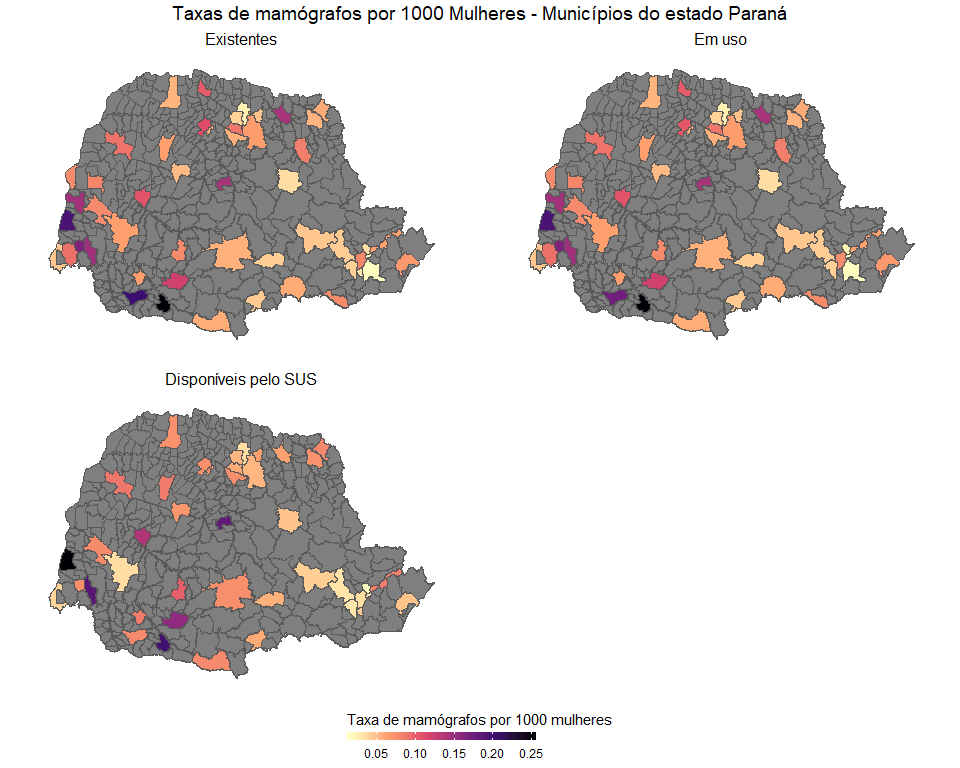

Estatísticas descritivas: resumo das variáveis
================

-   [Tabela de estatísticas descritivas](#tabela-de-estatísticas-descritivas)
-   [Código para 'traduzir' e renderizar uma tabela do `R` para o LaTeX](#código-para-traduzir-e-renderizar-uma-tabela-do-r-para-o-latex)
-   [Mapas](#mapas)

Tabela de estatísticas descritivas
==================================

``` r
## taxas

rm(list=ls())

library(broom)
library(sf)
library(tidyverse)
library(scales)

aed_tab <- read_rds("./Tabelas/base_parana.rds") %>%
  st_set_geometry(NULL) %>%
  mutate(prop_populacao_urbana = (prop_populacao_urbana)*100) %>%
  select(-seq(1:3)) %>%
  # compute broom::tidy summary of each var
  map(~tidy(summary(.x))) %>% 
  do.call(rbind, . ) %>%  # VRAU!
  # ajustando os números para um formáto publicável
  transmute(
     variavel = rownames(.),
    `Mínimo`  = minimum, 
     Q1       = q1,      
     Mediana  = median,  
     Q3       = q3,      
    `Máximo`  = maximum, 
    `Média`   = mean
    )

# vetor pivot
aed_tab$`Variável` <- aed_tab$variavel


# construindo um vetor com os nomes 'arrumados'
variavel <- aed_tab$variavel[-c(4:11, 24:57)]  %>%
  str_to_title() %>%
  # e.g.: "idhm_2010" -> "idhm" 
  str_replace_all("_2010", "") %>%
  str_replace_all("_", " ") %>%
  str_replace("aca", "aça") %>%
  str_replace("nca", "nça") %>%
  str_replace("çao", "ção") %>%
  str_replace("Mamografos ", "Mamógrafos ") %>%
  str_replace("\\ sus", "\\ SUS") %>%
  str_replace("Obitos", "Óbitos") %>%
  str_replace_all("População residente ", "População ") %>%
  str_replace_all("saude", "saúde") %>%
  str_replace_all("Indice de gini", "Índice de Gini") %>%
  str_replace_all("per capita", "(pc)") %>%
  str_replace_all("Idhm", "IDHM") %>%
  str_replace_all(" do ", ": ") %>%
  str_replace("Probabilidade de sobrevive", "Prob. de sobrevivê") %>%
  str_replace("ate ", "até ") %>%
  str_replace("Area km2", "Área $KM^2$")

# variaveis em sequência de faiza etária
obito <- c(paste("Óbitos (", seq(20, 75, by=10), "-", seq(29,79,by=10), ")", sep = ""),
                 "Óbitos (80+)",
                 "Óbitos tot. idade")

pop_fem <- c(paste("Pop. feminina (", seq(0,75,by=5), "-", seq(4,79,by=5), ")", sep=""), "Pop. feminina (80+)")
pop_msc <- c(paste("Pop. masculina (",seq(0,75,by=5), "-", seq(4,79,by=5), ")", sep=""), "Pop. masculina (80+)")

aed_tab$`Variável`[-c(4:11, 24:57)] <- variavel
aed_tab$`Variável`[4:11]  <- obito
aed_tab$`Variável`[24:57] <- c(pop_fem, pop_msc)

write_rds(aed_tab, "./Tabelas/aed_tab.rds")

aed_tab %>%
  select("Variável", c(2:7)) %>%
  knitr::kable(digits=3)
```

| Variável                               |    Mínimo|        Q1|   Mediana|         Q3|       Máximo|      Média|
|:---------------------------------------|---------:|---------:|---------:|----------:|------------:|----------:|
| Mamógrafos existentes                  |     0.000|     0.000|     0.000|      0.000|       63.000|      0.519|
| Mamógrafos em uso                      |     0.000|     0.000|     0.000|      0.000|       60.000|      0.501|
| Mamógrafos SUS                         |     0.000|     0.000|     0.000|      0.000|       19.000|      0.263|
| Óbitos (20-29)                         |     0.000|     0.000|     0.000|      0.000|        2.000|      0.015|
| Óbitos (30-39)                         |     0.000|     0.000|     0.000|      0.000|        9.000|      0.120|
| Óbitos (40-49)                         |     0.000|     0.000|     0.000|      0.000|       20.000|      0.293|
| Óbitos (50-59)                         |     0.000|     0.000|     0.000|      0.000|       34.000|      0.456|
| Óbitos (60-69)                         |     0.000|     0.000|     0.000|      0.000|       43.000|      0.436|
| Óbitos (70-79)                         |     0.000|     0.000|     0.000|      0.000|       38.000|      0.323|
| Óbitos (80+)                           |     0.000|     0.000|     0.000|      0.000|       29.000|      0.201|
| Óbitos tot. idade                      |     0.000|     0.000|     0.000|      1.000|      175.000|      1.845|
| Óbitos cor brança                      |     0.000|     0.000|     0.000|      1.000|      153.000|      1.584|
| Óbitos cor preta                       |     0.000|     0.000|     0.000|      0.000|        3.000|      0.048|
| Óbitos cor amarela                     |     0.000|     0.000|     0.000|      0.000|        1.000|      0.015|
| Óbitos cor parda                       |     0.000|     0.000|     0.000|      0.000|        4.000|      0.105|
| Óbitos cor ignorado                    |     0.000|     0.000|     0.000|      0.000|       15.000|      0.075|
| Óbitos cor total raça                  |     0.000|     0.000|     0.000|      1.000|      175.000|      1.827|
| Planos saúde                           |     0.000|     3.000|     8.000|     28.000|      918.000|     47.190|
| População total                        |  1409.000|  5037.000|  9026.000|  17274.000|  1751907.000|  26176.757|
| População rural                        |     0.000|  1444.000|  2571.000|   4581.000|    47469.000|   3839.183|
| População urbana                       |   524.000|  2906.000|  5732.000|  12770.000|  1751907.000|  22337.574|
| População masculina                    |   699.000|  2542.000|  4549.000|   8777.500|   835115.000|  12859.634|
| População feminina                     |   710.000|  2478.000|  4539.000|   8720.000|   916792.000|  13317.123|
| Pop. feminina (0-4)                    |    37.000|   158.000|   299.000|    601.500|    53277.000|    879.511|
| Pop. feminina (5-9)                    |    49.000|   177.000|   338.000|    688.500|    54785.000|    946.138|
| Pop. feminina (10-14)                  |    62.000|   215.000|   410.000|    826.500|    63843.000|   1116.589|
| Pop. feminina (15-19)                  |    68.000|   226.500|   429.000|    793.000|    69461.000|   1150.048|
| Pop. feminina (20-24)                  |    47.000|   185.000|   355.000|    686.000|    79897.000|   1126.799|
| Pop. feminina (25-29)                  |    53.000|   178.000|   341.000|    668.000|    84484.000|   1111.672|
| Pop. feminina (30-34)                  |    56.000|   176.500|   342.000|    639.000|    79990.000|   1067.516|
| Pop. feminina (35-39)                  |    54.000|   184.500|   345.000|    627.000|    71894.000|   1010.073|
| Pop. feminina (40-44)                  |    57.000|   184.500|   337.000|    632.000|    68688.000|    988.143|
| Pop. feminina (45-49)                  |    40.000|   169.000|   308.000|    588.000|    66648.000|    911.586|
| Pop. feminina (50-54)                  |    32.000|   145.500|   262.000|    499.500|    58683.000|    776.885|
| Pop. feminina (55-59)                  |    30.000|   124.000|   231.000|    430.500|    47963.000|    643.323|
| Pop. feminina (60-64)                  |    25.000|   101.000|   187.000|    344.000|    36826.000|    504.484|
| Pop. feminina (65-69)                  |    17.000|    82.500|   150.000|    274.000|    26345.000|    379.576|
| Pop. feminina (70-74)                  |    16.000|    62.000|   112.000|    217.000|    20330.000|    286.571|
| Pop. feminina (75-79)                  |     5.000|    43.000|    72.000|    145.500|    15272.000|    201.183|
| Pop. feminina (80+)                    |    10.000|    45.000|    78.000|    148.500|    18406.000|    217.025|
| Pop. masculina (0-4)                   |    47.000|   160.000|   309.000|    620.000|    54642.000|    910.055|
| Pop. masculina (5-9)                   |    40.000|   183.500|   359.000|    711.000|    57263.000|    979.657|
| Pop. masculina (10-14)                 |    58.000|   229.000|   434.000|    835.000|    66150.000|   1161.784|
| Pop. masculina (15-19)                 |    65.000|   239.500|   437.000|    842.500|    70051.000|   1177.348|
| Pop. masculina (20-24)                 |    51.000|   195.000|   380.000|    694.500|    78657.000|   1132.178|
| Pop. masculina (25-29)                 |    46.000|   183.000|   349.000|    665.500|    81266.000|   1094.424|
| Pop. masculina (30-34)                 |    48.000|   172.500|   324.000|    634.500|    75240.000|   1028.667|
| Pop. masculina (35-39)                 |    44.000|   182.000|   330.000|    616.500|    66109.000|    963.286|
| Pop. masculina (40-44)                 |    50.000|   193.500|   341.000|    612.000|    61693.000|    933.281|
| Pop. masculina (45-49)                 |    49.000|   177.000|   320.000|    571.000|    56039.000|    843.261|
| Pop. masculina (50-54)                 |    39.000|   144.500|   267.000|    483.500|    48048.000|    708.373|
| Pop. masculina (55-59)                 |    23.000|   122.000|   224.000|    395.500|    39047.000|    581.436|
| Pop. masculina (60-64)                 |    16.000|   105.000|   182.000|    333.000|    28967.000|    453.228|
| Pop. masculina (65-69)                 |    19.000|    82.000|   148.000|    266.500|    19615.000|    335.160|
| Pop. masculina (70-74)                 |    17.000|    63.500|   112.000|    204.500|    14126.000|    248.907|
| Pop. masculina (75-79)                 |     9.000|    42.000|    74.000|    133.000|     9364.000|    160.704|
| Pop. masculina (80+)                   |     9.000|    39.000|    72.000|    126.000|     8838.000|    147.885|
| Índice de Gini                         |     0.330|     0.430|     0.470|      0.500|        0.660|      0.466|
| Esperança de vida ao nascer            |    70.910|    73.280|    74.270|     75.165|       77.170|     74.225|
| Prob. de sobrevivência até 60 anos     |    77.370|    81.160|    82.640|     83.920|       86.490|     82.485|
| Taxa de envelhecimento                 |     3.780|     7.650|     8.920|     10.070|       14.030|      8.827|
| Taxa de analfabetismo 15 anos ou mais  |     1.240|     7.610|    10.270|     13.020|       19.530|     10.368|
| Renda (pc)                             |   277.330|   516.705|   592.270|    684.355|     1581.040|    610.218|
| Renda (pc) media: 1º quinto mais pobre |    26.060|   110.790|   143.710|    180.015|      308.560|    145.300|
| Renda (pc) media: 2º quinto mais pobre |   112.970|   234.475|   282.770|    333.165|      546.570|    283.583|
| Renda (pc) media: 3º quinto mais pobre |   191.760|   358.925|   421.680|    474.695|      854.540|    418.420|
| Renda (pc) media: 4º quinto mais pobre |   319.410|   525.030|   587.410|    672.515|     1430.780|    605.625|
| Renda (pc) dos extremamente pobres     |     0.000|    26.535|    33.250|     38.800|       70.000|     32.558|
| Renda (pc) dos pobres                  |    54.630|    81.735|    91.120|     97.340|      122.850|     89.640|
| IDHM                                   |     0.546|     0.681|     0.706|      0.725|        0.823|      0.702|
| IDHM renda                             |     0.570|     0.670|     0.692|      0.715|        0.850|      0.692|
| IDHM longevidade                       |     0.765|     0.805|     0.821|      0.836|        0.870|      0.820|
| IDHM educação                          |     0.362|     0.576|     0.621|      0.655|        0.768|      0.611|
| Área *K**M*<sup>2</sup>                |    61.000|   214.500|   353.000|    625.500|     3179.000|    499.496|
| Dens demogr                            |     3.312|    16.698|    25.100|     38.090|     4027.372|     62.064|
| Prop população urbana                  |     9.346|    55.272|    71.900|     84.224|      100.000|     68.389|
| População mulheres                     |   582.000|  2077.500|  3900.000|   7226.000|   799529.000|  11284.940|
| Mamógrafos existentes taxa             |     0.000|     0.000|     0.000|      0.000|        0.250|      0.010|
| Mamógrafos em uso taxa                 |     0.000|     0.000|     0.000|      0.000|        0.250|      0.010|
| Mamógrafos SUS taxa                    |     0.000|     0.000|     0.000|      0.000|        0.196|      0.006|
| Óbitos total idade taxa                |     0.000|     0.000|     0.000|      0.226|        1.220|      0.145|
| Planos saúde taxa                      |     0.000|     0.891|     2.324|      5.463|      189.860|      5.774|

Código para 'traduzir' e renderizar uma tabela do `R` para o LaTeX
==================================================================

``` r
library(kableExtra)

aed_tab %>%
  select("Variável", c(2:7)) %>%
  slice(c(1:57,74)) %>%
  mutate(`Média` = round(`Média`,1)) %>%
  kable(format = "latex",
       # align = 'c',
        format.args = list(decimal.mark=",", big.mark=".", scientific=FALSE),
        booktabs = T,
        longtable = T,
        caption = "Resumo das Variáveis - discretas",
        digit=0,
        escape = FALSE,
        linesep = "") %>%
  kable_styling(latex_options = c("striped", "repeat_header", "scale_down"))

aed_tab %>%
  select("Variável", c(2:7)) %>%
  slice(-c(1:57, 74)) %>%
  mutate(`Média` = round(`Média`,3)) %>%
    kable(format = "latex",
          digits = 3,
        #align = 'c',
        format.args = list(decimal.mark=",", big.mark=".", scientific=FALSE),
        booktabs = T,
        longtable = T,
        caption = "Resumo das Variáveis - contínuas",
        escape = FALSE,
        linesep = "") %>%
 kable_styling(latex_options = c("striped", "repeat_header", "scale_down"))
```

Mapas
=====

Dados:

``` r
rm(list=ls())

library(broom)
library(sf)
library(tidyverse)
library(scales)

(base_parana <- read_rds("./Tabelas/base_parana.rds") %>%
    gather(situacao, taxa_de_mamografos,
          -c(cod_ibge:populacao_mulheres,
             obitos_total_idade_taxa:geometry),
          factor_key = T) %>%
   group_by(situacao) %>%
   nest())
```

    ## # A tibble: 3 x 2
    ##   situacao                   data               
    ##   <fct>                      <list>             
    ## 1 mamografos_existentes_taxa <tibble [399 x 84]>
    ## 2 mamografos_em_uso_taxa     <tibble [399 x 84]>
    ## 3 mamografos_sus_taxa        <tibble [399 x 84]>

``` r
zeros <- base_parana$data %>%
  map(~ifelse(.x$taxa_de_mamografos>0, "não zero", "zero"))

base_parana$data <- map2(base_parana$data,
                         zeros,
                         ~mutate(.x, non_zero = .y))

com_mamogr <- base_parana$data %>%
  map(~st_set_geometry(.x, NULL)) %>%
  map(~filter(.x, non_zero=="não zero")) %>%
  map(~select(.x, municipio, mamografos_existentes, mamografos_sus, mamografos_em_uso))


#--
no_classes <- 6
quantiles <- com_mamogr %>%
  map(~{quantile(.$taxa_de_mamografos, probs = seq(0, 1, length.out = no_classes + 1))})
#--

titulos <- c("Existentes", "Em uso", "Disponíveis pelo SUS")

# gera os gráficos
mapas <- map2(base_parana$data, titulos, ~{
               ggplot(.x, aes(fill = ifelse(non_zero == "não zero", taxa_de_mamografos, NA))) +  # cria o ggplot
                geom_sf() +                    # desenha o mapa
                ggtitle(.y) +                  # adiciona o título
                theme(plot.title  = element_text(size = 12, hjust =.5),
                      axis.text.x = element_blank(),
                      axis.text.y = element_blank(),
                      axis.line.x = element_blank(),
                      axis.line.y = element_blank(),
                      panel.background = element_blank(),
                      panel.grid       = element_blank(),
                      panel.grid.major = element_line(colour = "white"),
                      axis.title.x = element_blank(),
                      axis.title.y = element_blank(),
                      axis.ticks   = element_blank(),
                      legend.position = "bottom") +
                # this is the main part
                scale_fill_viridis_c(option    = "magma",
                                     direction = -1,
                                     name      = "Taxa de mamógrafos por 1000 mulheres",
                                     # here we use guide_colourbar because it is still a continuous scale
                                     guide     = guide_colorbar(direction = "horizontal",
                                                                barheight = unit( 2, units = "mm"),
                                                                barwidth  = unit(50, units = "mm"),
                                                                draw.ulim = F,
                                                                title.position = 'top',
                                                                title.hjust = 0.5,
                                                                label.hjust = 0.5))
               
            })
```

Utilizamos o `ggpubr::ggarrange` para enquadrar as localidades.

``` r
library(ggpubr)
mapas <- ggarrange(mapas[[1]], mapas[[2]], mapas[[3]],
                   ncol   = 2,
                   nrow   = 2,
                   align  = "hv",
                   legend = "bottom", 
                   common.legend = TRUE) %>%
  annotate_figure(.,
                 top = text_grob("Taxas de mamógrafos por 1000 Mulheres - Municípios do estado Paraná",
                                 color  = "black",
                                 vjust  = .5,
                                 size   = 14,
                                 family = "Times",
                                 just   = "center"))

mapas
```


