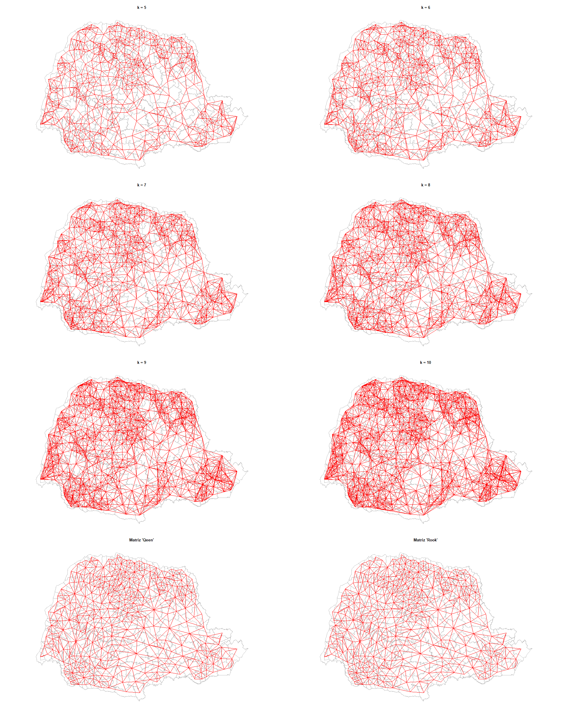
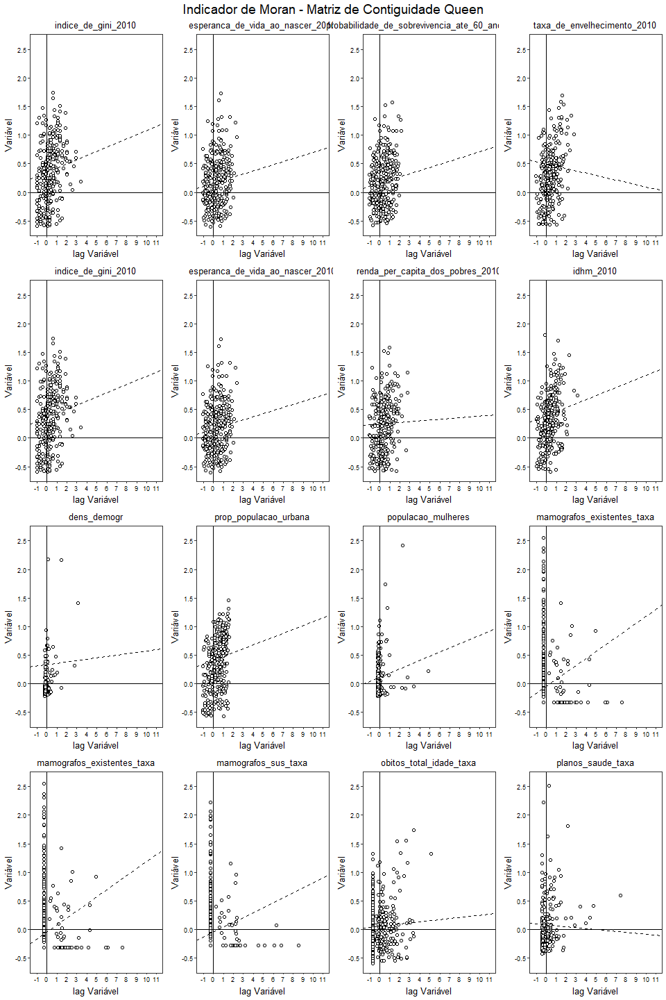
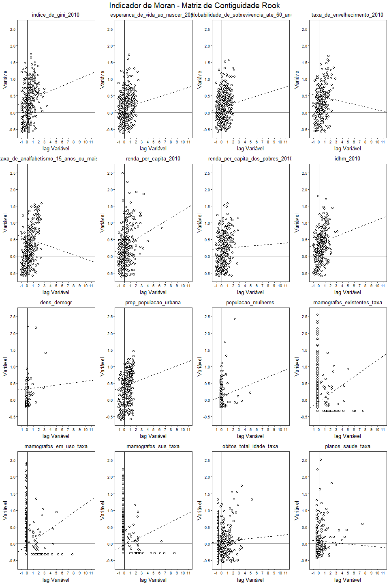
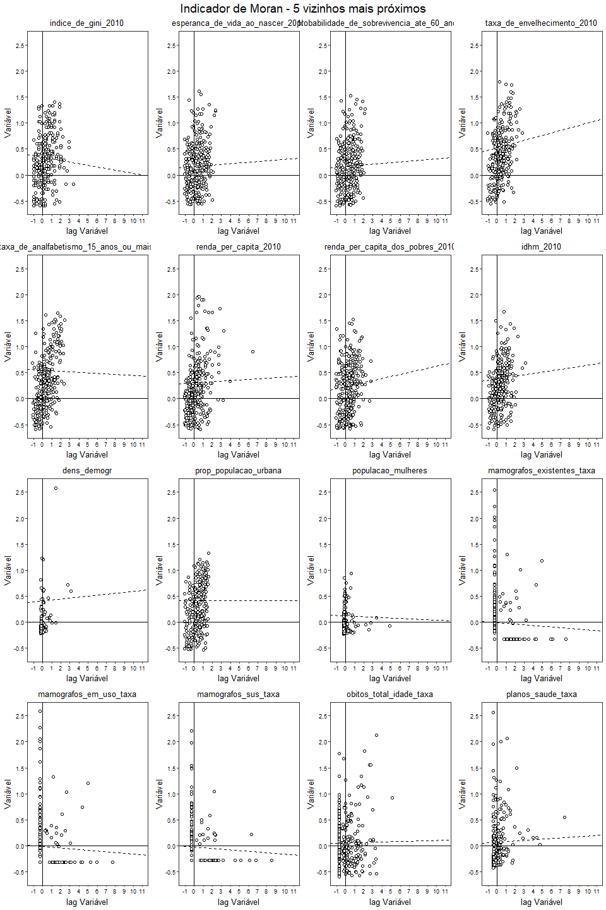
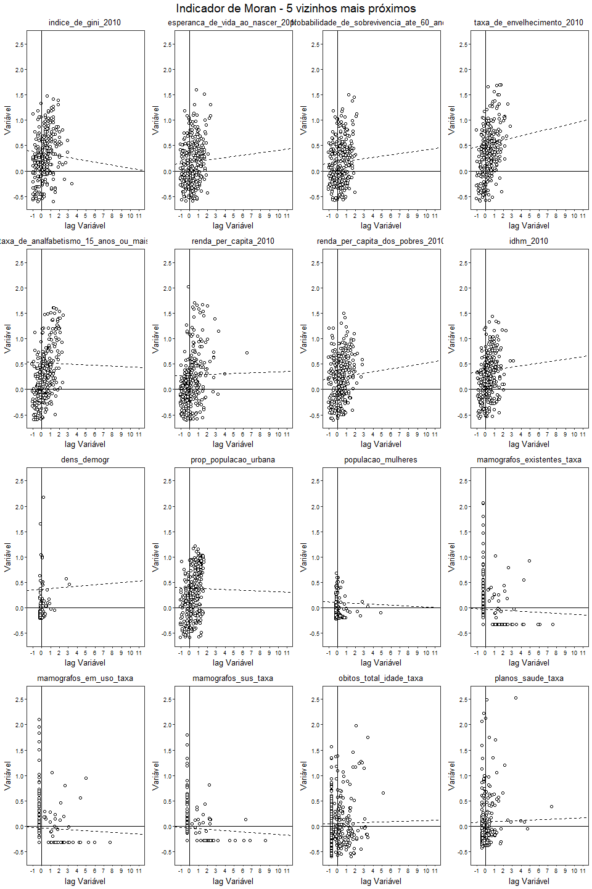
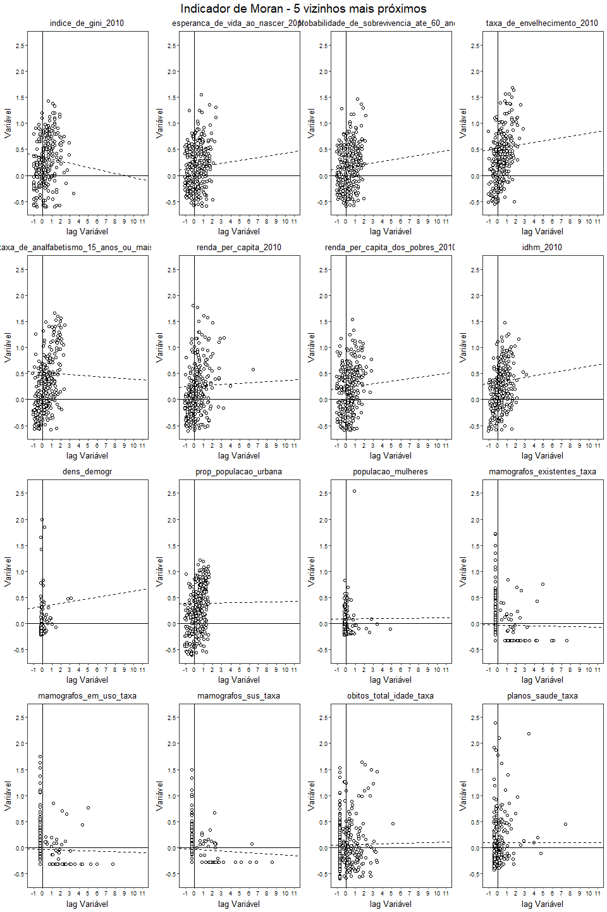
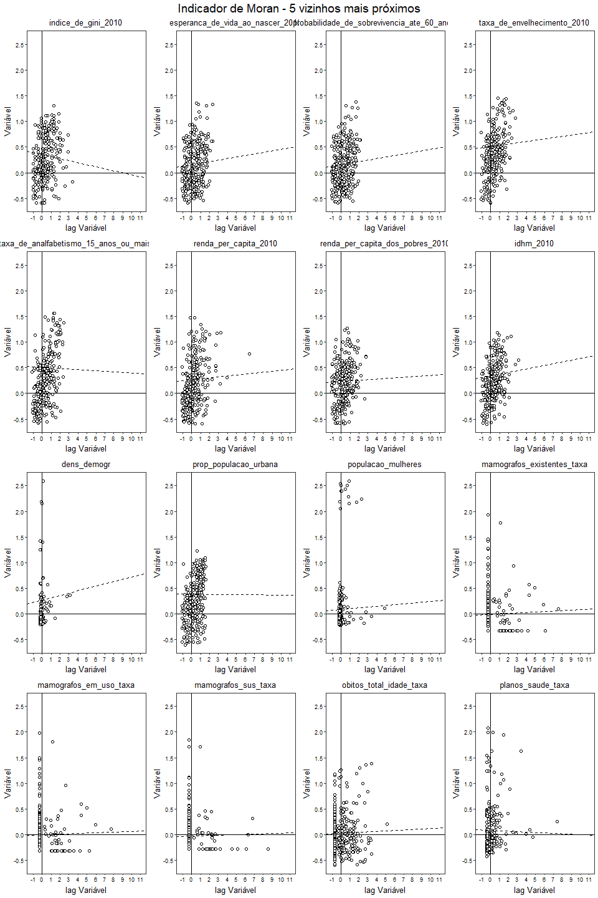

Autocorrelação Espacial
================

-   [Matriz de Contiguidade](#matriz-de-contiguidade)
-   [\[FIX\] Microrregião de saúde:](#fix-microrregião-de-saúde)
-   [Vizualizando contiguidade:](#vizualizando-contiguidade)
-   [Variáveis defasadas espacialmente](#variáveis-defasadas-espacialmente)
    -   [Carregando as tabelas](#carregando-as-tabelas)
    -   [Defasagem espacial (*lag*)](#defasagem-espacial-lag)
    -   [Cálculo do Índice de Moran](#cálculo-do-índice-de-moran)
    -   [Diagrama de dispersão de Moran](#diagrama-de-dispersão-de-moran)
        -   [Matriz *queen*](#matriz-queen)
        -   [Matriz *rook*](#matriz-rook)
        -   [5 Vizinhos mais próximos](#vizinhos-mais-próximos)
        -   [6 vizinhos mais próximos](#vizinhos-mais-próximos-1)
        -   [7 vizinhos mais próximos](#vizinhos-mais-próximos-2)
        -   [8 vizinhos mais próximos](#vizinhos-mais-próximos-3)
        -   [9 vizinhos mais próximos](#vizinhos-mais-próximos-4)
        -   [10 vizinhos mais próximos](#vizinhos-mais-próximos-5)

Matriz de Contiguidade
----------------------

A obtenção da matriz de vizinhança é feita à partir do objeto do tipo `sp`

``` r
rm(list=ls())

library(tidyverse)
library(sf) 
library(readr)

sp_parana <- read_rds("./Tabelas/base_parana.rds") %>% as("Spatial")
class(sp_parana)
```

    ## [1] "SpatialPolygonsDataFrame"
    ## attr(,"package")
    ## [1] "sp"

Foram definidas 8 tipos de matrizes diferentes:

-   Vizinhança por fronteira: *queen* e *rook*
-   Vizinhança por distância: 5 a 10 vizinhos mais próximos

``` r
library(spdep)
w_knear <- SpatialPoints(sp_parana)

# lista com matrizes de vizinhanças
lista_w <- list(w_queen = nb2listw(poly2nb(sp_parana, queen = T), style = "W"),
                w_rook  = nb2listw(poly2nb(sp_parana, queen = F), style = "W"),
                w_knear5  = nb2listw(knn2nb(knearneigh(w_knear, k = 5))),
                w_knear6  = nb2listw(knn2nb(knearneigh(w_knear, k = 6))),
                w_knear7  = nb2listw(knn2nb(knearneigh(w_knear, k = 7))),
                w_knear8  = nb2listw(knn2nb(knearneigh(w_knear, k = 8))),
                w_knear9  = nb2listw(knn2nb(knearneigh(w_knear, k = 9))),
                w_knear10 = nb2listw(knn2nb(knearneigh(w_knear, k = 10)))
                )
```

\[FIX\] Microrregião de saúde:
------------------------------

``` r
print("Inserir matriz de micorregioes de saúde")
```

    ## [1] "Inserir matriz de micorregioes de saúde"

``` r
library(spdep)
micro <- read.gal("./shp/w/micro.gal", override.id = TRUE)
summary(micro)
```

    ## Neighbour list object:
    ## Number of regions: 5570 
    ## Number of nonzero links: 86136 
    ## Percentage nonzero weights: 0.2776351 
    ## Average number of links: 15.46427 
    ## 2 regions with no links:
    ## 355030 530010
    ## Link number distribution:
    ## 
    ##   0   1   2   3   4   5   6   7   8   9  10  11  12  13  14  15  16  17 
    ##   2   2  21  56 145 174 196 256 279 230 330 288 325 294 285 144 221 306 
    ##  18  19  20  21  22  23  24  25  26  27  28  29  30  31  32  33  36  41 
    ## 190 240 210 176 115 168 175 130 108 140  29  60  31  32  99  34  37  42 
    ## 2 least connected regions:
    ## 500320 500520 with 1 link
    ## 42 most connected regions:
    ## 220005 220025 220027 220095 220157 220173 220180 220209 220213 220255 220327 220340 220415 220420 220430 220435 220480 220500 220515 220520 220595 220605 220650 220720 220755 220777 220780 220800 220820 220865 220910 220935 220940 220985 221020 221030 221037 221070 221093 221150 221160 221170 with 41 links

Vizualizando contiguidade:
--------------------------



Variáveis defasadas espacialmente
=================================

Carregando as tabelas
---------------------

Os mamógrafos são classificados por:

-   Existentes: Soma de todos os mamógrafos existentes na localidade
-   Em uso: Subtrai os mamógrafos sem uso dos existentes
-   Disponível pelo SUS: mamógrafos utilizados na rede pública de saúde

Para começar a análise, optamos pelo agrupamento dos dados nesas 3 categorias. A função `purrr::nest` faz esse trabalho aninhando uma base de dados para cada categoria.

``` r
(base_parana <- read_rds("./Tabelas/base_parana.rds") %>% 
   select(-c(mamografos_existentes:mamografos_sus,
             obitos_20_a_29_anos:populacao_masculina_com_80_anos_e_mais_2010,
             67:71,
             idhm_renda_2010:area_km2)) %>%
   gather(situacao, key, -c(cod_ibge:municipio, geometry),
          factor_key = T) %>%
   group_by(situacao) %>%
   nest())
```

    ## # A tibble: 16 x 2
    ##    situacao                                        data              
    ##    <fct>                                           <list>            
    ##  1 indice_de_gini_2010                             <tibble [399 x 5]>
    ##  2 esperanca_de_vida_ao_nascer_2010                <tibble [399 x 5]>
    ##  3 probabilidade_de_sobrevivencia_ate_60_anos_2010 <tibble [399 x 5]>
    ##  4 taxa_de_envelhecimento_2010                     <tibble [399 x 5]>
    ##  5 taxa_de_analfabetismo_15_anos_ou_mais_2010      <tibble [399 x 5]>
    ##  6 renda_per_capita_2010                           <tibble [399 x 5]>
    ##  7 renda_per_capita_dos_pobres_2010                <tibble [399 x 5]>
    ##  8 idhm_2010                                       <tibble [399 x 5]>
    ##  9 dens_demogr                                     <tibble [399 x 5]>
    ## 10 prop_populacao_urbana                           <tibble [399 x 5]>
    ## 11 populacao_mulheres                              <tibble [399 x 5]>
    ## 12 mamografos_existentes_taxa                      <tibble [399 x 5]>
    ## 13 mamografos_em_uso_taxa                          <tibble [399 x 5]>
    ## 14 mamografos_sus_taxa                             <tibble [399 x 5]>
    ## 15 obitos_total_idade_taxa                         <tibble [399 x 5]>
    ## 16 planos_saude_taxa                               <tibble [399 x 5]>

Defasagem espacial (*lag*)
--------------------------

É construída através da função `spdep::lag.listw`

``` r
# no cálculo da taxa, a função scale() padroniza os dados:
situacao <- map(base_parana$situacao, ~rep(.x, 399))


base_parana$data <- base_parana$data %>% 
   map(~mutate(.x, taxa = scale(key)))

# lista com taxas defasadass de acordo com a matriz de contiguidade
(base_parana <- map2(.x = base_parana$data,
                     .y = list(rep(lista_w, 3)),
                     .f = ~{mutate(.x, queen   = lag.listw(.y$w_queen, .x$taxa),
                                       rook    = lag.listw(.y$w_rook, .x$taxa),
                                       knear5  = lag.listw(.y$w_knear5, .x$taxa),
                                       knear6  = lag.listw(.y$w_knear6, .x$taxa),
                                       knear7  = lag.listw(.y$w_knear7, .x$taxa),
                                       knear8  = lag.listw(.y$w_knear8, .x$taxa),
                                       knear9  = lag.listw(.y$w_knear9, .x$taxa),
                                       knear10 = lag.listw(.y$w_knear10, .x$taxa),
                                   )}) %>%
                  map(.f = ~{st_set_geometry(., NULL)}) %>%
                  map(.f = ~{select(., cod_ibge, cod_munici, municipio, taxa:knear10)}) %>%
                  map2_df(.x = .,
                          .y = situacao,
                          .f = ~{mutate(.x, situacao = .y)}) %>%
                  group_by(situacao) %>%
                  nest() %>%
                  rename(lags = data) %>%
                  left_join(base_parana, ., by="situacao"))
```

    ## # A tibble: 16 x 3
    ##    situacao                                        data        lags       
    ##    <fct>                                           <list>      <list>     
    ##  1 indice_de_gini_2010                             <tibble [3~ <tibble [3~
    ##  2 esperanca_de_vida_ao_nascer_2010                <tibble [3~ <tibble [3~
    ##  3 probabilidade_de_sobrevivencia_ate_60_anos_2010 <tibble [3~ <tibble [3~
    ##  4 taxa_de_envelhecimento_2010                     <tibble [3~ <tibble [3~
    ##  5 taxa_de_analfabetismo_15_anos_ou_mais_2010      <tibble [3~ <tibble [3~
    ##  6 renda_per_capita_2010                           <tibble [3~ <tibble [3~
    ##  7 renda_per_capita_dos_pobres_2010                <tibble [3~ <tibble [3~
    ##  8 idhm_2010                                       <tibble [3~ <tibble [3~
    ##  9 dens_demogr                                     <tibble [3~ <tibble [3~
    ## 10 prop_populacao_urbana                           <tibble [3~ <tibble [3~
    ## 11 populacao_mulheres                              <tibble [3~ <tibble [3~
    ## 12 mamografos_existentes_taxa                      <tibble [3~ <tibble [3~
    ## 13 mamografos_em_uso_taxa                          <tibble [3~ <tibble [3~
    ## 14 mamografos_sus_taxa                             <tibble [3~ <tibble [3~
    ## 15 obitos_total_idade_taxa                         <tibble [3~ <tibble [3~
    ## 16 planos_saude_taxa                               <tibble [3~ <tibble [3~

Cálculo do Índice de Moran
--------------------------

``` r
library(broom)

(base_parana <- base_parana %>% 
    
      mutate(moran_queen   = map(base_parana$lags, ~lm(queen ~ taxa, data = .x)) %>% map(tidy), 
             moran_rook    = map(base_parana$lags, ~lm(rook ~ taxa, data = .x)) %>% map(tidy),
             moran_knear5  = map(base_parana$lags, ~lm(knear5 ~ taxa, data = .x))  %>% map(tidy),
             moran_knear6  = map(base_parana$lags, ~lm(knear6 ~ taxa, data = .x)) %>% map(tidy),
             moran_knear7  = map(base_parana$lags, ~lm(knear7 ~ taxa, data = .x)) %>% map(tidy),
             moran_knear8  = map(base_parana$lags, ~lm(knear8 ~ taxa, data = .x)) %>% map(tidy),
             moran_knear9  = map(base_parana$lags, ~lm(knear9 ~ taxa, data = .x)) %>% map(tidy),
             moran_knear10 = map(base_parana$lags, ~lm(knear10 ~ taxa, data = .x)) %>% map(tidy)
             
              ))
```

    ## # A tibble: 16 x 11
    ##    situacao  data   lags  moran_queen moran_rook moran_knear5 moran_knear6
    ##    <fct>     <list> <lis> <list>      <list>     <list>       <list>      
    ##  1 indice_d~ <tibb~ <tib~ <data.fram~ <data.fra~ <data.frame~ <data.frame~
    ##  2 esperanc~ <tibb~ <tib~ <data.fram~ <data.fra~ <data.frame~ <data.frame~
    ##  3 probabil~ <tibb~ <tib~ <data.fram~ <data.fra~ <data.frame~ <data.frame~
    ##  4 taxa_de_~ <tibb~ <tib~ <data.fram~ <data.fra~ <data.frame~ <data.frame~
    ##  5 taxa_de_~ <tibb~ <tib~ <data.fram~ <data.fra~ <data.frame~ <data.frame~
    ##  6 renda_pe~ <tibb~ <tib~ <data.fram~ <data.fra~ <data.frame~ <data.frame~
    ##  7 renda_pe~ <tibb~ <tib~ <data.fram~ <data.fra~ <data.frame~ <data.frame~
    ##  8 idhm_2010 <tibb~ <tib~ <data.fram~ <data.fra~ <data.frame~ <data.frame~
    ##  9 dens_dem~ <tibb~ <tib~ <data.fram~ <data.fra~ <data.frame~ <data.frame~
    ## 10 prop_pop~ <tibb~ <tib~ <data.fram~ <data.fra~ <data.frame~ <data.frame~
    ## 11 populaca~ <tibb~ <tib~ <data.fram~ <data.fra~ <data.frame~ <data.frame~
    ## 12 mamograf~ <tibb~ <tib~ <data.fram~ <data.fra~ <data.frame~ <data.frame~
    ## 13 mamograf~ <tibb~ <tib~ <data.fram~ <data.fra~ <data.frame~ <data.frame~
    ## 14 mamograf~ <tibb~ <tib~ <data.fram~ <data.fra~ <data.frame~ <data.frame~
    ## 15 obitos_t~ <tibb~ <tib~ <data.fram~ <data.fra~ <data.frame~ <data.frame~
    ## 16 planos_s~ <tibb~ <tib~ <data.fram~ <data.fra~ <data.frame~ <data.frame~
    ## # ... with 4 more variables: moran_knear7 <list>, moran_knear8 <list>,
    ## #   moran_knear9 <list>, moran_knear10 <list>

Diagrama de dispersão de Moran
------------------------------

### Matriz *queen*

``` r
plot_my_data <- function(mydata, y) {
    ggplot(mydata) + 
      geom_point(aes_string(x = 'taxa', y = y), 
                 shape  = 21,
                 fill   = "white",
                 size   = 1.2,
                 stroke =  .6) + 
      
      theme_bw(base_size = 8) +
      theme(plot.title       = element_text(hjust = .5),
            plot.subtitle    = element_text(hjust = .5, margin = margin(b = -10)),
            axis.text        = element_text(colour = "black"),
            axis.text.x      = element_text(size = 6.5),
            axis.text.y      = element_text(size = 6.5),
            axis.ticks       = element_line(size =  .3),
            axis.line        = element_blank(),
            axis.title.x     = element_text(size = 10),
            axis.title.y     = element_text(size = 10),
            panel.background = element_rect(size = .3),
            panel.grid = element_blank()) +
              
      labs(x = "lag Variável",
           y = "Variável") +
  
      scale_y_continuous(limits = c(-.6, 2.6),
                         breaks = seq(-.5, 2.5, by = 0.5)) +
      scale_x_continuous(limits = c(-1.1, 11),
                         breaks = seq(-1, 11, by = 1)) +  
  
      geom_vline(xintercept = 0, size = .3) +
      geom_hline(yintercept = 0, size = .3) }

titulos <- base_parana$situacao
 
library(ggpubr)
queen <- base_parana$lags %>% 
   map2(.x = .,c(rep("queen", 16)), ~{plot_my_data(.x, .y)}) %>% 
   map2(., titulos, ~{.x + ggtitle(.y)}) %>%
   map2(., base_parana$moran_queen, ~{.x + geom_abline(slope = .y$estimate[[1]],
                                                       intercept = .y$estimate[[2]],
                                                       size = .5, linetype = 'dashed')}) #%>%
#   map(. , ~{ggarrange(.x, ncol = 3, nrow   = 1, align  = "hv")})


ggarrange(queen[[1]],  queen[[2]],  queen[[3]],  queen[[4]],
          queen[[1]],  queen[[2]],  queen[[7]],  queen[[8]],
          queen[[9]],  queen[[10]], queen[[11]], queen[[12]],
          queen[[12]], queen[[14]], queen[[15]], queen[[16]],
          ncol   = 4,
          nrow   = 4,
          align  = "hv",
          legend = "bottom",
          common.legend = TRUE) %>%
  annotate_figure(.,
                  top = text_grob("Indicador de Moran - Matriz de Contiguidade Queen",
                                  color  = "black",
                                  vjust  = .5,
                                  size   = 14,
                                  family = "Times",
                                  just   = "center"))
```



### Matriz *rook*

``` r
rook <- base_parana$lags %>% 
   map2(.x = ., c(rep("rook", 16)), ~{plot_my_data(.x, .y)}) %>% 
   map2(., titulos, ~{.x + ggtitle(.y)}) %>%
   map2(., base_parana$moran_rook, ~{.x + geom_abline(slope     = .y$estimate[[1]],
                                                      intercept = .y$estimate[[2]],
                                                      size = .5, linetype = 'dashed')}) #%>%
#   map(. , ~{ggarrange(.x, ncol = 3, nrow   = 1, align  = "hv")})

ggarrange(rook[[1]],  rook[[2]],  rook[[3]],  rook[[4]],
          rook[[5]],  rook[[6]],  rook[[7]],  rook[[8]],
          rook[[9]],  rook[[10]], rook[[11]], rook[[12]],
          rook[[13]], rook[[14]], rook[[15]], rook[[16]],
          ncol   = 4,
          nrow   = 4,
          align  = "hv",
          legend = "bottom",
          common.legend = TRUE) %>%
  annotate_figure(.,
                  top = text_grob("Indicador de Moran - Matriz de Contiguidade Rook",
                                  color  = "black",
                                  vjust  = .5,
                                  size   = 14,
                                  family = "Times",
                                  just   = "center"))
```



### 5 Vizinhos mais próximos



### 6 vizinhos mais próximos



### 7 vizinhos mais próximos



### 8 vizinhos mais próximos


### 9 vizinhos mais próximos



### 10 vizinhos mais próximos


